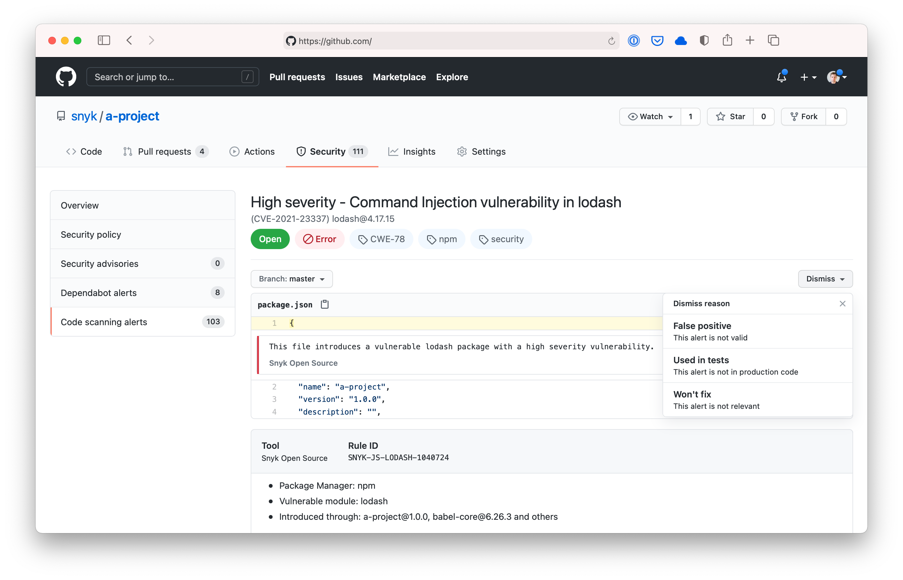

# Khulnasoft Python (3.8)  Action

A [GitHub Action](https://github.com/features/actions) for using [Khulnasoft](https://khulnasoft.co/KhulnasoftGH) to check for
vulnerabilities in your Python-3.8 projects. This Action is based on the [Khulnasoft CLI][cli-gh] and you can use [all of its options and capabilities][cli-ref] with the `args`.

 > Note: The examples shared below reflect how Khulnasoft github actions can be used. Khulnasoft requires Python to have downloaded the dependencies before running or triggering the Khulnasoft checks.
                          > The Python image checks and installs deps only if the manifest files are present in the current path (from where action is being triggered)
                          > 1. If pip is present on the current path , and Khulnasoft finds a requirements.txt file, then Khulnasoft runs pip install -r requirements.txt.
                          > 2. If pipenv is present on the current path, and Khulnasoft finds a Pipfile without a Pipfile.lock, then Khulnasoft runs pipenv update
                          > 3. If pyproject.toml is present in the current path and Khulnasoft does not find poetry.lock then Khulnasoft runs pip install poetry
                          >
                          > If manifest files are present under any location other root then they MUST be installed prior to running Khulnasoft.

You can use the Action as follows:

```yaml
name: Example workflow for Python using Khulnasoft
on: push
jobs:
  security:
    runs-on: ubuntu-latest
    steps:
      - uses: actions/checkout@master
      - name: Run Khulnasoft to check for vulnerabilities
        uses: khulnasoft/actions/python-3.8@master
        env:
          KHULNASOFT_TOKEN: ${{ secrets.KHULNASOFT_TOKEN }}
```

## Properties

The Khulnasoft Python Action has properties which are passed to the underlying image. These are passed to the action using `with`.

| Property | Default | Description                                                                                         |
| -------- | ------- | --------------------------------------------------------------------------------------------------- |
| args     |         | Override the default arguments to the Khulnasoft image. See [Khulnasoft CLI reference for all options][cli-ref] |
| command  | test    | Specify which command to run, for instance test or monitor                                          |
| json     | false   | In addition to the stdout, save the results as khulnasoft.json                                            |

For example, you can choose to only report on high severity vulnerabilities.

```yaml
name: Example workflow for Python using Khulnasoft
on: push
jobs:
  security:
    runs-on: ubuntu-latest
    steps:
      - uses: actions/checkout@master
      - name: Run Khulnasoft to check for vulnerabilities
        uses: khulnasoft/actions/python-3.8@master
        env:
          KHULNASOFT_TOKEN: ${{ secrets.KHULNASOFT_TOKEN }}
        with:
          args: --severity-threshold=high
```

## Uploading Khulnasoft scan results to GitHub Code Scanning

Using `--sarif-file-output` [Khulnasoft CLI flag][cli-ref] and the [official GitHub SARIF upload action](https://docs.github.com/en/code-security/secure-coding/uploading-a-sarif-file-to-github), you can upload Khulnasoft scan results to the GitHub Code Scanning.



The Khulnasoft Action will fail when vulnerabilities are found. This would prevent the SARIF upload action from running, so we need to introduce a [continue-on-error](https://docs.github.com/en/actions/reference/workflow-syntax-for-github-actions#jobsjob_idstepscontinue-on-error) option like this:

```yaml
name: Example workflow for Python using Khulnasoft
on: push
jobs:
  security:
    runs-on: ubuntu-latest
    steps:
      - uses: actions/checkout@master
      - name: Run Khulnasoft to check for vulnerabilities
        uses: khulnasoft/actions/python-3.8@master
        continue-on-error: true # To make sure that SARIF upload gets called
        env:
          KHULNASOFT_TOKEN: ${{ secrets.KHULNASOFT_TOKEN }}
        with:
          args: --sarif-file-output=khulnasoft.sarif
      - name: Upload result to GitHub Code Scanning
        uses: github/codeql-action/upload-sarif@v2
        with:
          sarif_file: khulnasoft.sarif
```

Made with 💜 by Khulnasoft

[cli-gh]: https://github.com/khulnasoft/khulnasoft 'Khulnasoft CLI'
[cli-ref]: https://docs.khulnasoft.com/khulnasoft-cli/cli-reference 'Khulnasoft CLI Reference documentation'
